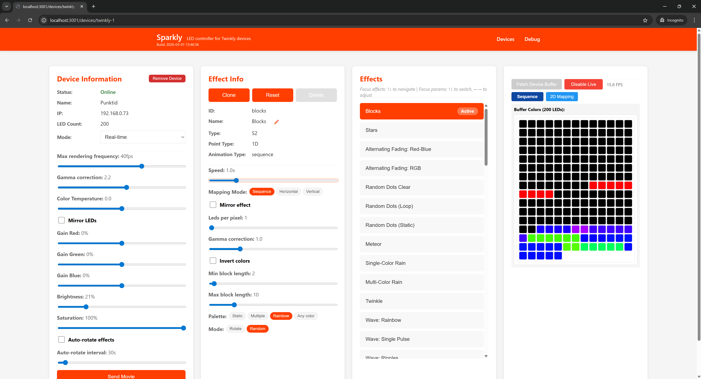

# Sparkly

LED controller for [Twinkly](https://www.twinkly.com/) smart LED devices. Control effects, brightness, and colors through a web interface served from a single executable.



## Table of Contents

- [Background](#background)

- [Current State](#current-state)

- [Download & Run](#download--run)

- [Using Sparkly](#using-sparkly)
  - [Adding Devices](#adding-devices)

  - [Controlling Devices](#controlling-devices)

  - [LED Preview](#led-preview)

  - [Debug Page](#debug-page)

- [Troubleshooting](#troubleshooting)

- [Requirements](#requirements)

**[Developer Guide](#developer-guide)**

- [Architecture](#architecture)
  - [Colors](#colors)

  - [Parameters (Backend-Driven UI)](#parameters-backend-driven-ui)

  - [Effects Abstraction](#effects-abstraction)

  - [Modules](#modules)

- [Prerequisites](#prerequisites)

- [Getting Started](#getting-started)

- [Scripts](#scripts)

- [Building the Executable](#building-the-executable)

- [API Reference](#api-reference)

- [Further Documentation](#further-documentation)

## Background

This is a pet project I have created during free time to play with my LED lights at home.
From the original [Twinkly mobile app](https://apps.apple.com/us/app/twinkly/id1132187056) I was missing:

1. Selection of effects in general.
2. 1D effects for LED strips which work on the level of individual LEDs.
3. Long effects which might not fit on the device memory.
4. Freedom to choose colors randomly.
5. Adjust for 100+100 strips so it looks natural (reverse one branch) without using 2D mapping.

## Current State

> **Beta** — Mostly stable but may have bugs. Future versions may break compatibility.

### Features

#### Standalone App

- **Web-based UI** — runs in background; access from the same device, another computer, or phone

- **Persistent settings** — saved to disk once per minute and on exit

#### Device Management

- **Auto-discovery** or manual add by IP address

- **Multiple devices** handled in parallel

- Should support all Twinkly devices (tested with 4 device types; RGB+W uses RGB only)

#### Effects

- **Real-time** (app must run) or **uploaded as a looping movie** to device hardware

- **Auto-rotate** effects with a custom interval (real-time mode only)

- **Rename, clone, reset, or delete** effects (built-in effects cannot be deleted)

- **Live LED preview** in the browser

#### Per-Device Settings

- Brightness, saturation, gamma correction, color temperature, RGB gain

- Mirror LEDs, adjust FPS

#### Per-Effect Settings

- **Speed** multiplier (separate from FPS)

- **Geometry** — mirror, 1D→2D mapping mode, 2D rotation, LEDs per pixel

- **Color correction** — gamma, invert

- **Movie config** — loop cycle count (some effects)

#### Palette & Color Options (many effects)

- **Color space** — Static (1 color), Multiple (n colors), Rainbow, Any

- **Order** — Round robin or random

- **Easing** — instant or smooth transitions between colors

## Download & Run

1. **Download** the latest release from [GitHub Releases](../../releases)
2. **Extract** the zip archive
3. **Run** `sparkly.exe`
4. The browser opens automatically to **<http://localhost:3001>**

No installation or setup required — the executable is fully self-contained.

## Using Sparkly

### Adding Devices

When you first open Sparkly, head to the **Devices** page. You can add your Twinkly devices in two ways:

- **Auto-discover** — Click the discover button to scan your network for Twinkly devices

- **Manual add** — Enter the device's IP address directly

Devices are remembered between sessions automatically.

### Controlling Devices

Each device card on the Devices page lets you:

- **Set mode** — Switch between off, color, effect, and other device modes

- **Adjust brightness** — Slide to set brightness (0–100%)

- **Choose an effect** — Pick from the built-in effect library

- **Tune parameters** — Customize effect colors, speed, and other settings

- **Send movie** — Render an effect and upload it directly to the device hardware

### LED Preview

The web interface can mirror your device's LED state in real time. Two viewing modes are available:

- **Sequential** — LEDs shown in order, ideal for LED strips

- **2D mapped** — LEDs positioned using the device's 2D coordinate mapping

### Debug Page

The **Debug** page provides detailed device information and effect metadata — useful for troubleshooting connection issues.

## Troubleshooting

| Problem                                  | Solution                                                                                    |
| ---------------------------------------- | ------------------------------------------------------------------------------------------- |
| **Windows SmartScreen warning**          | Click **More info**, then click **Run anyway**                                              |
| **"Unknown Publisher" security warning** | Click **Run** to proceed                                                                    |
| **Can't find devices**                   | Make sure Twinkly devices are powered on and connected to the same network as your computer |
| **Port 3001 in use**                     | Close any other application using port 3001, then restart Sparkly                           |
| **Frontend won't load**                  | Try re-downloading the latest release                                                       |

## Requirements

- Windows (the executable is self-contained, no runtime needed)

- Twinkly LED devices on the same local network

---

# Developer Guide

Everything below is for contributors and developers working on the Sparkly source code.

## Architecture

### Colors

Effects internally work with **floating-point RGB** (`RgbFloat` — channels 0.0–1.0) for better precision during color math, blending, and correction. The final conversion to 8-bit (`Rgb24` — 0–255) only happens at the output stage, after gamma, gain, and temperature corrections are applied.

In the **UI**, users choose colors in **HSL** (hue, saturation, lightness) or **RGB**, depending on the parameter type. A `ColorValue` discriminated union (`{ mode: HSL, hsl }` or `{ mode: RGB, rgb }`) preserves the user's chosen color model through serialization, while the backend wraps it in a polymorphic `Color` object that effects can call `.asRgb()` on regardless of the underlying mode.

| Type         | Location                                                    | Role                                                               |
| ------------ | ----------------------------------------------------------- | ------------------------------------------------------------------ |
| `RgbFloat`   | [ColorFloat.ts](packages/backend/src/color/ColorFloat.ts)   | Internal working color space (0.0–1.0 floats)                      |
| `Rgb24`      | [Color8bit.ts](packages/backend/src/color/Color8bit.ts)     | Output format sent to LED hardware (0–255)                         |
| `Hsl`        | [ParameterTypes.ts](packages/backend/src/ParameterTypes.ts) | HSL representation (hue/saturation/lightness, all 0.0–1.0)         |
| `Color`      | [Color.ts](packages/backend/src/color/Color.ts)             | Polymorphic wrapper — `HslColor` or `RgbColor`, converts on demand |
| `ColorValue` | [ParameterTypes.ts](packages/backend/src/ParameterTypes.ts) | Serializable union for persistence and UI (HSL or RGB mode)        |

The output pipeline applies corrections per-pixel in order: invert → channel gain → gamma → color temperature → float-to-8-bit.

### Parameters (Backend-Driven UI)

Effect UIs are **entirely driven by the backend** through a parameter abstraction. Effects declare their parameters in code, and the frontend renders matching UI controls automatically — no frontend changes needed for new effects.

Each parameter has a **type** that maps to a UI control:

| Parameter Type | UI Control                               | Value                             |
| -------------- | ---------------------------------------- | --------------------------------- |
| `RANGE`        | Slider                                   | `number` (with min/max/step)      |
| `BOOLEAN`      | Toggle                                   | `boolean`                         |
| `OPTION`       | Tag list (single-select)                 | `string` (from a list of options) |
| `HSL`          | HSL color picker                         | `Hsl`                             |
| `RGB`          | RGB color picker                         | `RgbFloat`                        |
| `COLOR`        | Color picker with HSL/RGB mode switch    | `ColorValue`                      |
| `MULTI_HSL`    | Multiple HSL swatches                    | `Hsl[]`                           |
| `MULTI_COLOR`  | Multiple color swatches with mode switch | `ColorValue[]`                    |

Effects create an `EffectParameterStorage`, register parameters on it, and expose it as a `parameters` property. The frontend calls `GET /api/info` to discover all parameters and renders the appropriate controls. When a user changes a value, `POST /api/parameters` validates and updates it on the backend.

**Composable parameter groups** let effects reuse common UI sections:

- **PaletteParameters** — color space + order selection (adds a "Palette" section)

- **FullEasingParameters** — easing function + direction (adds an "Easing" section)

These are combined with the effect's own parameters via `MultiParameterStorageView`, which namespaces each group (e.g. `custom.`, `palette.`, `easing.`) into a single flat parameter list for the API.

### Effects Abstraction

Effects are the core creative unit — each one describes how LEDs should look at any given moment. The system separates **what** an effect looks like from **how** it's rendered and delivered to a device.

Effects compute colors **directly for the actual LEDs** on the device. There is no virtual framebuffer or large image that gets sampled — each LED's position is passed to the effect, and the effect returns a color for it. This means effects naturally adapt to any LED count or layout without wasted computation.

#### Key Concepts

| Concept               | File(s)                                                                  | Role                                                                               |
| --------------------- | ------------------------------------------------------------------------ | ---------------------------------------------------------------------------------- |
| **Effect**            | [Effect.ts](packages/backend/src/effects/Effect.ts)                      | Interface defining an effect's metadata, parameters, and a `createLogic()` factory |
| **EffectLogic**       | [Effect.ts](packages/backend/src/effects/Effect.ts)                      | The rendering workhorse — implements `renderGlobal(ctx, points): RgbFloat[]`       |
| **EffectWrapper**     | [EffectWrapper.ts](packages/backend/src/EffectWrapper.ts)                | Wraps any effect with orthogonal settings (speed, gamma, mirror, mapping)          |
| **EffectLibrary**     | [EffectLibrary.ts](packages/backend/src/effects/EffectLibrary.ts)        | Registry — `register(EffectClass)` to add effects, manages clone/delete/reset      |
| **EffectParameters**  | [EffectParameters.ts](packages/backend/src/EffectParameters.ts)          | Storage + validation for runtime-adjustable parameters with change tracking        |
| **Renderer**          | [Renderer.ts](packages/backend/src/render/Renderer.ts)                   | Drives the render loop (live real-time or batch for movie upload)                  |
| **FrameOutputStream** | [FrameOutputStream.ts](packages/backend/src/render/FrameOutputStream.ts) | Composable output chain (send to device, buffer for UI preview, record movie)      |

#### Animation Modes

Every effect declares one of three animation modes which determines what context it receives:

- **Static** — no time input; re-renders each frame to pick up parameter changes

- **Loop** — receives `phase` (0.0–1.0); must define `getLoopDurationSeconds()`

- **Sequence** — receives `time_ms` and `delta_time_ms` for open-ended animations

#### Point Types

Effects are generic over spatial input:

- **1D** — each LED has `id` (hardware buffer index), `position` (sequential integer index along the strip), and `distance` (float 0.0–1.0, normalized position)

- **2D** — each LED has `id`, `x`, and `y` coordinates (floats 0.0–1.0) from the device's 2D mapping. The mapping must be created first using the official [Twinkly app](https://apps.apple.com/us/app/twinkly/id1132187056) (via its mapping scan feature) — the coordinates are persisted on the device itself, and Sparkly reads them from there

1D effects can run on 2D-mapped devices via the wrapper's mapping mode (sequence, horizontal, vertical).

**1D addressing styles:** A 1D effect can work in two ways depending on what spatial property it uses:

- **Discrete (per-LED)** — use `point.id` or `point.position` to treat each LED as an individual pixel. `position` accounts for the "LEDs per pixel" grouping (multiple consecutive hardware LEDs share the same position). Good for dot-based effects like random dots or stars.

- **Continuous (normalized distance)** — use `point.distance` (0.0–1.0) to treat the strip as a smooth space. Better for gradients, waves, and sweeps where the result should scale naturally across any LED count.

#### Base Classes

Located in [BaseEffects.ts](packages/backend/src/effects/BaseEffects.ts) — reduce boilerplate for common patterns:

| Base Class            | Use When                                                                                     |
| --------------------- | -------------------------------------------------------------------------------------------- |
| `PerPixelEffect`      | Each LED is rendered independently (stateless). Override `renderPixel(ctx, point): RgbFloat` |
| `BaseSameColorEffect` | All LEDs show the same color. Override `renderColor(ctx): RgbFloat`                          |
| `StatelessEffect`     | The effect IS its own logic (no separate state)                                              |

For **stateful** effects that need memory between frames (particle systems, etc.), implement `Effect` directly and return a separate `EffectLogic` class from `createLogic()`.

#### Composable Parameter Groups

Effects can compose reusable parameter groups into their parameter view:

- **PaletteParameters** ([Palette.ts](packages/backend/src/effects/util/Palette.ts)) — color space (static, multiple, rainbow, any) + order (round robin, random)

- **FullEasingParameters** ([EasingMode.ts](packages/backend/src/effects/util/EasingMode.ts)) — easing function + direction for smooth transitions

These are combined with the effect's own parameters via `MultiParameterStorageView`.

#### Utilities (`effects/util/`)

| Utility                                                                  | Purpose                                                 |
| ------------------------------------------------------------------------ | ------------------------------------------------------- |
| [Palette.ts](packages/backend/src/effects/util/Palette.ts)               | Color palette implementations and parameter group       |
| [Easing.ts](packages/backend/src/effects/util/Easing.ts)                 | Easing functions (linear, quadratic, cubic, sine, etc.) |
| [NoiseUtils.ts](packages/backend/src/effects/util/NoiseUtils.ts)         | Simplex noise wrapper with seamless loop support        |
| [PhaseUtils.ts](packages/backend/src/effects/util/PhaseUtis.ts)          | Phase transformations (reverse, back-and-forth)         |
| [FlashAnimation.ts](packages/backend/src/effects/util/FlashAnimation.ts) | Reusable on/off flash helper                            |
| [ArrayUtils.ts](packages/backend/src/effects/util/ArrayUtils.ts)         | Buffer creation, shuffling                              |

#### Creating a New Effect

1. Create a file in [effects/library/](packages/backend/src/effects/library/)

2. For a simple per-pixel effect, extend `PerPixelEffect`:

   ```typescript
   export class MyEffect extends PerPixelEffect<AnimationMode.Loop, LedPoint1D> implements EffectLoop<LedPoint1D> {
     animationMode = AnimationMode.Loop;
     effectClassId = 'my-effect';
     pointType = '1D' as const;
     isStateful = false;
     effectId = 'my-effect';
     effectName = 'My Effect';

     getLoopDurationSeconds = () => 2;

     renderPixel(ctx: EffectContextLoop, point: LedPoint1D): RgbFloat {
       const brightness = (Math.sin(point.position * Math.PI * 2 + ctx.phase * Math.PI * 2) + 1) / 2;
       return { r: brightness, g: 0, b: brightness };
     }
   }
   ```

3. Register in [EffectLibrary.ts](packages/backend/src/effects/EffectLibrary.ts):

   ```typescript
   register(MyEffect);
   ```

For effects with multiple presets, implement `getPresets()` instead of `effectId`/`effectName` — each preset becomes a separate entry in the library with its own default parameter values.

#### Rendering Pipeline

```
EffectLauncher
  ├── startEffect()        → live real-time rendering
  │     EffectRenderer.renderLive()
  │       └── loop: createLogic() → renderGlobal() → floatTo8bit → FrameOutputStream
  │             └── MultipleFrameOutputStream
  │                   ├── ApiClientFrameOutputStream  (sends to device via UDP)
  │                   └── BufferReplacingFrameOutputStream  (UI preview)
  │
  └── sendEffectAsMovie()  → batch render + upload
        EffectRenderer.renderAsap()
          └── all frames → MovieBufferOutputStream → postMovieFull()
```

#### Movie Rendering

When sending an effect as a movie to the device, the renderer needs to produce a finite loop. How this works depends on the animation mode:

- **Loop (phase-based)** — the effect defines a fixed loop duration. The renderer records one full cycle (phase 0.0→1.0). Increasing the **loop cycles** parameter renders multiple consecutive cycles into the movie, which gives palette-based effects more room to show additional colors since each cycle may pick different colors.

- **Sequence (self-terminating)** — the effect runs open-ended and signals when it has completed a natural cycle (via `cycleJustCompleted`). This gives better results for effects with randomness, since the effect itself decides when it has covered enough ground to close the loop.

The resulting movie seamlessness varies:

- Some effects loop **perfectly** (e.g. smooth gradients, waves)

- Some may have a **visible jump** at the loop point (e.g. effects with random state)

- For some it **depends on the palette** — a 2-color palette may loop cleanly while a 5-color one may need more cycles to look seamless. Random palettes (Rainbow, Any color) are especially likely to produce a visible jump since the start and end colors won't match

### Modules

Sparkly is a TypeScript monorepo (npm workspaces) with three packages:

| Package             | Description                                               |
| ------------------- | --------------------------------------------------------- |
| `@sparkly/common`   | Shared API contract and types (Zod + ts-rest)             |
| `@sparkly/backend`  | Express backend — device communication, effects, REST API |
| `@sparkly/frontend` | SvelteKit frontend — web UI                               |

See [docs/ARCHITECTURE.md](docs/ARCHITECTURE.md) for module boundaries and design decisions.

```
packages/
├── common/          # Shared API contract and types
├── backend/         # Express backend server
│   └── src/
│       ├── server.ts          # Development server
│       ├── server-node.ts     # Production server (Node.js)
│       ├── server-bun.ts      # Production server (Bun executable)
│       ├── ApiController.ts   # Route handlers
│       ├── deviceClient/      # Twinkly device protocol
│       ├── effects/           # LED effect library
│       └── render/            # Frame rendering
└── frontend/        # SvelteKit web interface
    └── src/
        ├── routes/            # Pages (devices, debug)
        ├── components/        # Svelte components
        └── FrontendApiClient.ts
scripts/             # Build & distribution scripts
docs/                # Developer documentation
```

## Prerequisites

- Node.js v18+

- npm

## Getting Started

```bash
# Install all dependencies
npm install

# Start backend (http://localhost:3001)
npm run dev:backend

# In another terminal — start frontend (http://localhost:5173)
npm run dev:frontend
```

## Scripts

| Script                         | Description                                            |
| ------------------------------ | ------------------------------------------------------ |
| `npm run dev:backend`          | Backend with hot reload (port 3001)                    |
| `npm run dev:frontend`         | Frontend with hot reload (port 5173)                   |
| `npm run build`                | Build all packages                                     |
| `npm run build:common`         | Build shared types                                     |
| `npm run build:backend`        | Build backend                                          |
| `npm run build:frontend`       | Build frontend                                         |
| `npm run build:executable`     | Build self-contained Windows executable (requires Bun) |
| `npm run package:distribution` | Build + create distribution zip                        |
| `npm run start:backend`        | Run compiled backend                                   |
| `npm run start:frontend`       | Preview built frontend                                 |

## Building the Executable

```bash
npm run package:distribution
```

Creates a ready-to-distribute package at `dist/sparkly-package/` containing the executable, frontend assets, and documentation. See [docs/BUILD_EXECUTABLE.md](docs/BUILD_EXECUTABLE.md) for details.

## API Reference

The backend REST API runs on port 3001.

**Device Management:**

- `GET /api/info` — Devices and effects list

- `GET /api/system-info` — Build date, version, device modes

- `GET /api/device/discover` — Discover Twinkly devices on the network

- `POST /api/device/add` — Add a device by IP

- `POST /api/device/remove` — Remove a device

- `POST /api/device/reconnect` — Reconnect a device

**Device Control:**

- `POST /api/mode` — Set device mode

- `POST /api/brightness` — Set brightness (0–100)

- `POST /api/effect` — Choose effect

- `POST /api/parameters` — Set effect parameters

- `POST /api/sendMovie` — Render and upload movie to device

- `GET /api/sendMovie/status` — Movie upload progress

- `GET /api/buffer` — Current LED buffer (browser LED mirroring)

- `GET /api/ledMapping` — LED 2D coordinates (browser LED mirroring)

**Effect Management:**

- `POST /api/effect/clone` — Clone an effect

- `POST /api/effect/delete` — Delete an effect

- `POST /api/effect/rename` — Rename an effect

- `POST /api/effect/reset` — Reset effect state

**Debug:**

- `GET /api/hello` — Health check

- `GET /api/debug/device` — Device details

- `GET /api/debug/effects` — All effects with metadata

## Further Documentation

- [Architecture](docs/ARCHITECTURE.md) — Module structure and boundaries

- [Build Executable](docs/BUILD_EXECUTABLE.md) — Building the self-contained executable

- [Validation Guide](docs/VALIDATION_GUIDE.md) — Testing the distribution package

- [Logging](docs/LOGGING.md) — Logger configuration and usage

- [Noise Effects](docs/NOISE_EFFECTS.md) — Using simplex noise in effects
